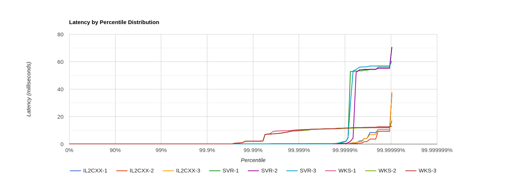

# IL2CXX

IL2CXX is yet another .NET IL to C++ transpiler.

This is an EXPERIMENTAL study to see the potential of [Recylone](https://github.com/shin1m/recyclone).

There are a lot of missing pieces in .NET runtime support as they are implemented as needed.

# Requirements

* .NET 6
* C++17 or later

Currently, it is built and tested only by using GCC 11.x on Linux x86-64.

# How to

## Run Tests

	cd IL2CXX.Tests
	LD_LIBRARY_PATH=$DOTNET_ROOT/shared/Microsoft.NETCore.App/6.0.x dotnet test

This requires a lot of memory.
Specify `NUnit.NumberOfTestWorkers` based on the available memory.

	LD_LIBRARY_PATH=$DOTNET_ROOT/shared/Microsoft.NETCore.App/6.0.x dotnet test -- NUnit.NumberOfTestWorkers=2

## Transpile and Build .NET Core Executable

	cd IL2CXX.Console
	dotnet run .../Foo.dll out-Foo

	mkdir out-Foo/build
	cd out-Foo/build
	cmake -DCMAKE_BUILD_TYPE=Release ..
	cmake --build . -j6 # or whatever

	LD_LIBRARY_PATH=$DOTNET_ROOT/shared/Microsoft.NETCore.App/6.0.x ./Foo

`cmake --build .` takes really long time.

Below are build durations on my Core i7-8550U laptop:
* [MonoGame.Samples](https://github.com/MonoGame/MonoGame.Samples) Platformer2D - 25 minutes
* [bepuphysics2](https://github.com/bepu/bepuphysics2) Demos.GL - 100 minutes

# Comparing GC Pauses

I compared GC pauses in IL2CXX to those in .NET 6 preview using the same way introduced by [this blog post](https://mattwarren.org/2017/01/13/Analysing-Pause-times-in-the-.NET-GC/).

The full code is in `gc_latency_experiment` directory.

Below is the result:

Regarding latency distribtion, IL2CXX looks better than both the Workstation GC (WKS) and the Server GC (SVR) of .NET 6 preview.
Regarding total time, SVR is the fastest. (SVR < IL2CXX < WKS)

IL2CXX is advantageous in this particular case because no cycles (cyclic object graphs) are involved in the case.
Without cycles, all it has to do is concurrent reference counting, and running cycle collection only increases GC pause.

Another thing found here is that the max GC pause in IL2CXX is two times longer than that in the Workstation GC.
There are several options to consider in order to reduce the max GC pause:

* Size of increment/decrement queues.
  * `recyclone::t_slot<>::t_increments`
  * `recyclone::t_slot<>::t_decrements`
* Frequency of cycle collection.
  * `recyclone::t_engine<>::v_collector__threshold`
* Batch size of cycle collection.

Currently, the last item can not be adjusted.
The cycle collection always processes all the candidate roots at once.
I think it is possible to change the cycle collection to finish early leaving the rest of the candidate roots to the next epoch.

# License

The MIT License (MIT)

Copyright (c) 2021 Shin-ichi MORITA

Permission is hereby granted, free of charge, to any person obtaining a copy
of this software and associated documentation files (the "Software"), to deal
in the Software without restriction, including without limitation the rights
to use, copy, modify, merge, publish, distribute, sublicense, and/or sell
copies of the Software, and to permit persons to whom the Software is
furnished to do so, subject to the following conditions:

The above copyright notice and this permission notice shall be included in
all copies or substantial portions of the Software.

THE SOFTWARE IS PROVIDED "AS IS", WITHOUT WARRANTY OF ANY KIND, EXPRESS OR
IMPLIED, INCLUDING BUT NOT LIMITED TO THE WARRANTIES OF MERCHANTABILITY,
FITNESS FOR A PARTICULAR PURPOSE AND NONINFRINGEMENT.  IN NO EVENT SHALL THE
AUTHORS OR COPYRIGHT HOLDERS BE LIABLE FOR ANY CLAIM, DAMAGES OR OTHER
LIABILITY, WHETHER IN AN ACTION OF CONTRACT, TORT OR OTHERWISE, ARISING FROM,
OUT OF OR IN CONNECTION WITH THE SOFTWARE OR THE USE OR OTHER DEALINGS IN
THE SOFTWARE.
